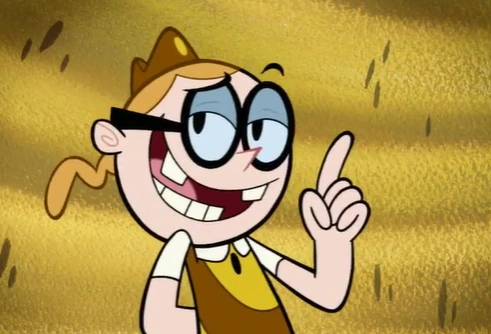

# ESTE ES UN PROYECTO DE REPASO CON REACT

En este proyecto crearemos un michi interactivo. Y también utilizaremos la sesión para poder guardar los datos del juego en un caché del navegador.

En fin, veremos qué tal lo haremos xddddd.

Las reglas son las siguientes:
- Solo extraer el código HTML
- Solo extraer el CSS

Asimismo, debajo del michi también haremos una selección de víctimas.
Las reglas son las mismas que las del michi.

#### EN FIN.
#### MUCHA SUERTE
